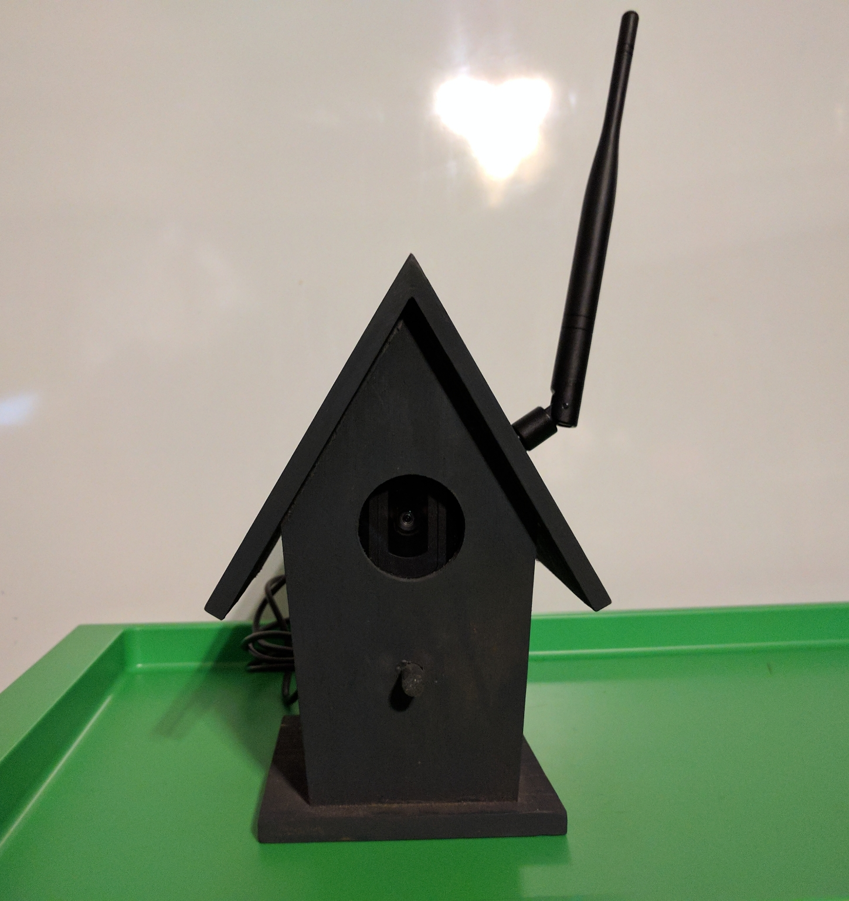
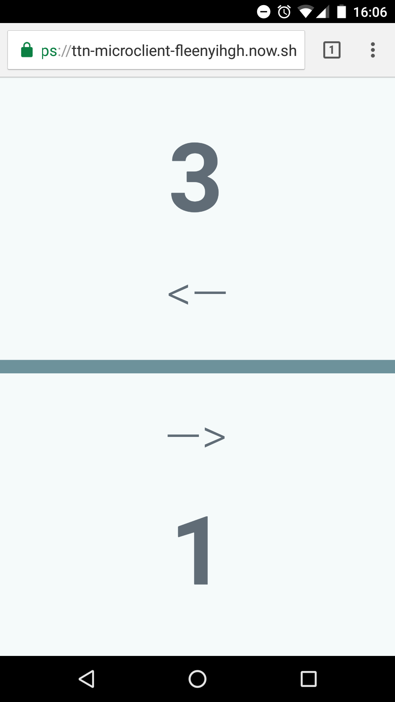

# OpenCV Bicycle Counter `#mz-bicycle-commuter`
## [\#MakeZurich](https://makezurich.ch/) - Civic tech and LoRaWAN hackathon for a better city
* Hackathon in Zurich, February 3-4, 2017
* [OpenCV Bicycle Counter](https://now.makezurich.ch/project/10) Project from [Samuel Bichsel](https://github.com/melbic) & [Michael Schmuki](https://github.com/boardend)

## About the "Bicycle commuter"-Challenge
"Dive into the pulse of the city and track/map/visualize bicycle commuters using low cost sensors and open data to calibrate your measurements."

* Challenge from [Tiefbau- und Entsorgungsdepartement - Stadt Zürich](https://www.stadt-zuerich.ch/ted/de/index/taz.html)
* See the [Slides](https://speakerdeck.com/gonzalocasas/make-zurich-kick-off)  from the Kick-Off Event
* Existing Data at [Daten der automatischen Fussgänger- und Velozählung - Viertelstundenwerte](https://data.stadt-zuerich.ch/dataset/verkehrszaehlungen-werte-fussgaenger-velo)

## About OpenCV Bicycle Counter
The project has three major parts.
* The detecto. A C++ program which detects and tracks the bicycles and writes the count to a files.
* The transmitter. A bash script, which runs as Crontab and which uploads the data to the TTN.
* The client application. A website, which shows the counts an updates itself when a new count arrives.

This is just a prototype. While it runs ok on a laptop, it really struggles on a Raspberry Pi 3.
### The prototype:

### The web client:

## Licence
* Code: MIT [License](LICENSE)
* Creative work: [CC-BY-SA 4.0](https://creativecommons.org/licenses/by-sa/4.0/)
